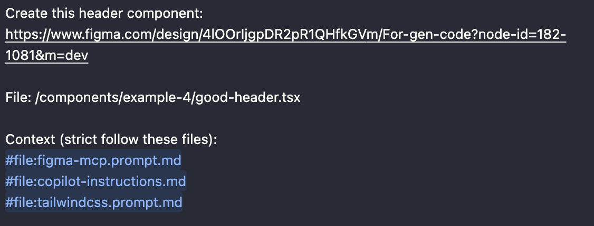

# Quick test Figma MCP power

## Setup

- Enable MCP server in figma app
- Add MCP server

```json
{
  "figma-desktop": {
    "type": "http",
    "url": "http://127.0.0.1:3845/mcp"
  }
}
```

## Agent contexts

- Model: GPT-4
- Make sure all the context files are imported in agent chat
- 

## Start

- Run dev

```bash
 yarn && yarn dev
```

## Examples

### Example 1 - Figma tokens

A. Prompt for bad buttons

```txt
Create this button with default and hover state:
https://www.figma.com/design/4lOOrIjgpDR2pR1QHfkGVm/For-gen-code?node-id=133-1041&m=dev

File: /components/example-1/bad-button.tsx

Context (strict follow these files):
#file:figma-mcp.prompt.md
#file:copilot-instructions.md
#file:tailwindcss.prompt.md
```

B. Prompt for good button

```txt
Create this button:
https://www.figma.com/design/4lOOrIjgpDR2pR1QHfkGVm/For-gen-code?node-id=1-1057&m=dev

File: /components/example-1/good-button.tsx

Context:
#file:figma-mcp.prompt.md #file:copilot-instructions.md #file:tailwindcss.prompt.md
```

### Example 2 - Component

A. Uncomponentized version

```txt
Create this link button with default and hover state:
https://www.figma.com/design/4lOOrIjgpDR2pR1QHfkGVm/For-gen-code?node-id=158-1023&m=dev

File:/components/example-2/bad-link-button.tsx

Context (strict follow these files):
#file:figma-mcp.prompt.md
#file:copilot-instructions.md
#file:tailwindcss.prompt.md
```

B. Componentized version

```txt
Create this link button with default and hover state:
https://www.figma.com/design/4lOOrIjgpDR2pR1QHfkGVm/For-gen-code?node-id=1-1062&m=dev

File: /components/example-2/good-link-button.tsx

Context (strict follow these files):
#file:figma-mcp.prompt.md
#file:copilot-instructions.md
#file:tailwindcss.prompt.md
```

### Example 3 - Naming

A. Header with BEM naming

```txt
Create this header component:
https://www.figma.com/design/4lOOrIjgpDR2pR1QHfkGVm/For-gen-code?node-id=182-1081&m=dev

File: /components/example-3/header-with-bem.tsx

Context (strict follow these files):
#file:figma-mcp.prompt.md
#file:copilot-instructions.md
#file:tailwindcss.prompt.md
```

### Example 4 - Auto layout

A. Header without auto layout

```txt
Create this header component:
https://www.figma.com/design/4lOOrIjgpDR2pR1QHfkGVm/For-gen-code?node-id=182-1083&m=dev

File: /components/example-4/bad-header.tsx

Context (strict follow these files):
#file:figma-mcp.prompt.md
#file:copilot-instructions.md
#file:tailwindcss.prompt.md
```

B. Header with auto layout

```txt
Create this header component:
https://www.figma.com/design/4lOOrIjgpDR2pR1QHfkGVm/For-gen-code?node-id=182-1081&m=dev

File: /components/example-4/good-header.tsx

Context (strict follow these files):
#file:figma-mcp.prompt.md
#file:copilot-instructions.md
#file:tailwindcss.prompt.md
```
